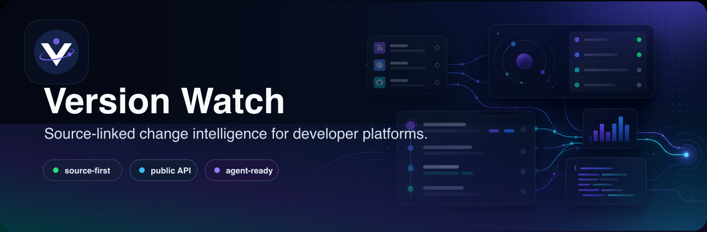

<p align="center">
  
</p>

# Version Watch

Change intelligence for developer platform updates.

[](./LICENSE)
[](https://github.com/parrisdigital/version-watch/releases)
[](https://versionwatch.dev)

Version Watch tracks official release notes, changelogs, docs updates, RSS feeds, blogs, and GitHub releases from developer platforms, then turns them into searchable, source-linked update records.

Use it to see what changed, why it matters, who should care, which stack area is affected, and where the official source lives.

## Live Project

- Website: [versionwatch.dev](https://versionwatch.dev)
- API docs: [versionwatch.dev/agent-access](https://versionwatch.dev/agent-access)
- OpenAPI: [versionwatch.dev/api/v1/openapi.json](https://versionwatch.dev/api/v1/openapi.json)
- Latest release: [v0.1.1](https://github.com/parrisdigital/version-watch/releases/tag/v0.1.1)

## Features

- Ranked homepage for recent high-signal platform changes
- Searchable update explorer with vendor, severity, tag, audience, release-class, and time filters
- Vendor directory and vendor-specific update feeds
- Canonical event pages with source provenance, citation helpers, and structured feedback
- Public JSON and Markdown feeds for tools, dashboards, and agents
- Freshness and source-health status endpoints
- Agent-facing resources including `agents.md`, `llms.txt`, `llms-full.txt`, and a portable Version Watch skill
- Protected admin/review workflows backed by Convex

## Public API

```bash
curl "https://versionwatch.dev/api/v1/updates?severity=high&limit=5"
curl "https://versionwatch.dev/api/v1/clusters?tag=api&limit=5"
curl "https://versionwatch.dev/api/v1/status"
curl "https://versionwatch.dev/feed.md"
```

Key routes:

- `/api/v1/updates` - paginated public updates
- `/api/v1/clusters` - grouped update bursts for alerts and digests
- `/api/v1/feed.json` and `/api/v1/feed.md` - feed formats
- `/api/v1/status` and `/api/v1/status/vendors` - freshness and source health
- `/api/v1/taxonomy` - valid vendors, severities, tags, audiences, and release classes
- `/api/v1/openapi.json` - OpenAPI contract

## Release Classes

Version Watch classifies updates as:

`breaking`, `security`, `model_launch`, `pricing`, `policy`, `api_change`, `sdk_release`, `cli_patch`, `beta_release`, `docs_update`, or `routine_release`.

Severity is represented as `critical`, `high`, `medium`, or `low`.

## Stack

- Next.js App Router
- React
- TypeScript
- Convex
- Vercel
- GitHub Actions
- Vitest and Playwright

This repository keeps `"private": true` in `package.json` because it is an application, not an npm package. That flag does not control GitHub repository visibility.

## Local Development

```bash
npm ci
cp .env.example .env.local
npm run dev
```

Local public pages can run without `NEXT_PUBLIC_CONVEX_URL`; the app falls back to bundled sample data outside production. Production requires a Convex deployment URL.

Useful checks:

```bash
npm run lint
npm test
npm run build
npm run test:e2e
```

Production health scripts require access to the production environment:

```bash
npm run health:production
npm run signal:production
npm run sources:production
npm run vendors:production
```

## Configuration

Application variables:

- `NEXT_PUBLIC_SITE_URL` - canonical public site URL, for example `https://versionwatch.dev`
- `NEXT_PUBLIC_CONVEX_URL` - public Convex deployment URL; required in production
- `CONVEX_DEPLOYMENT` - Convex CLI deployment name for local development
- `ADMIN_SECRET` - server-side secret for admin pages, review actions, and protected admin APIs
- `INGESTION_USER_AGENT` - optional user agent used by Convex ingestion fetches

GitHub Actions environment secrets:

- `CONVEX_DEPLOY_KEY` - Convex deploy key for deployment workflows
- `ADMIN_SECRET` - production admin secret for protected operational workflows

Do not commit real `.env` files, deploy keys, API tokens, webhook URLs, or production admin secrets.

## Documentation

- [Documentation index](./docs/README.md)
- [Changelog](./CHANGELOG.md)
- [Release process](./docs/release-process.md)
- [Architecture](./docs/architecture.md)
- [Vendor registry](./docs/vendor-registry.md)
- [Classification and ranking](./docs/classification-and-ranking.md)

## Contributing

Contributions are welcome. Start with [CONTRIBUTING.md](./CONTRIBUTING.md), and use GitHub Issues for bugs, source coverage suggestions, and feature requests.

Good first contribution areas include vendor source coverage, parser quality, documentation examples, public API reliability, and tests.

## Security

Please report vulnerabilities privately. See [SECURITY.md](./SECURITY.md).

## License

Version Watch is released under the [MIT License](./LICENSE).
